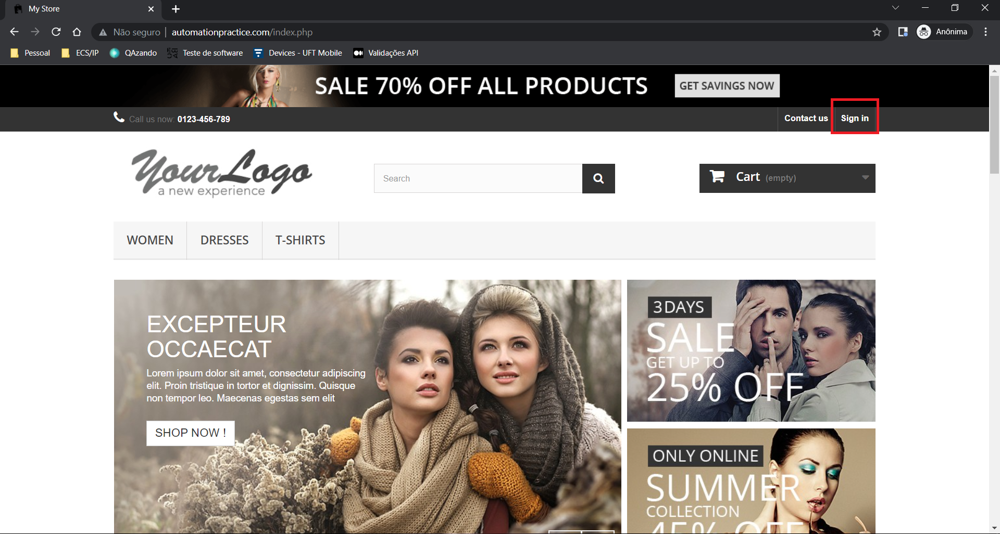
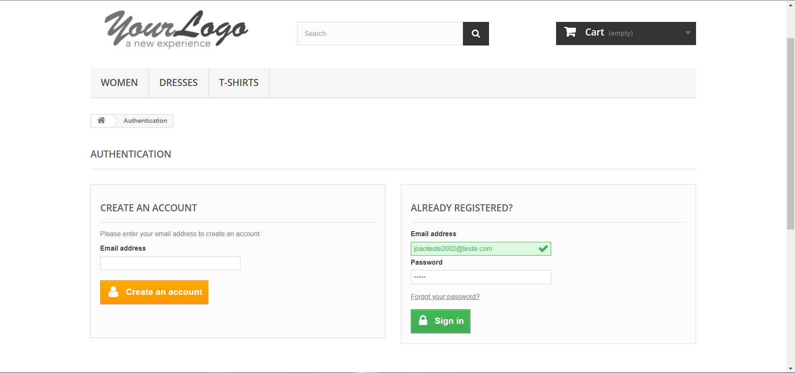
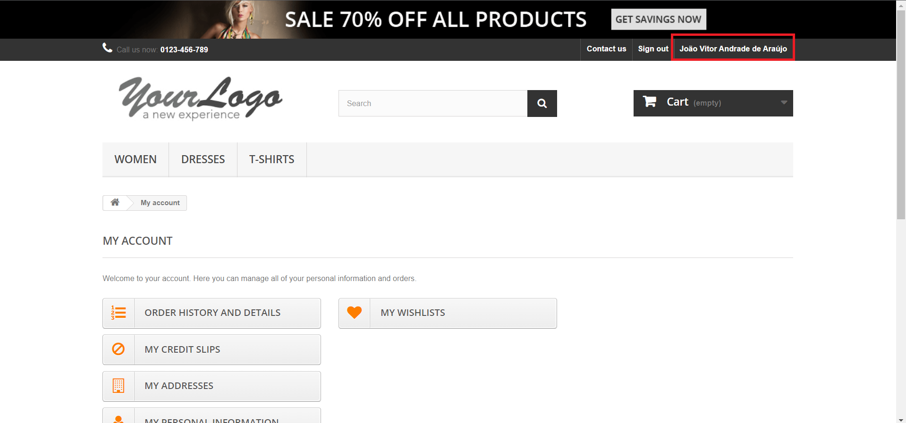
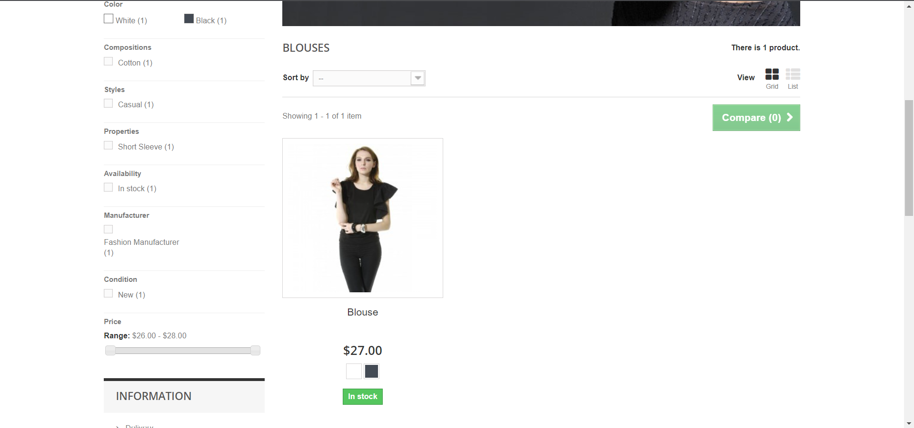
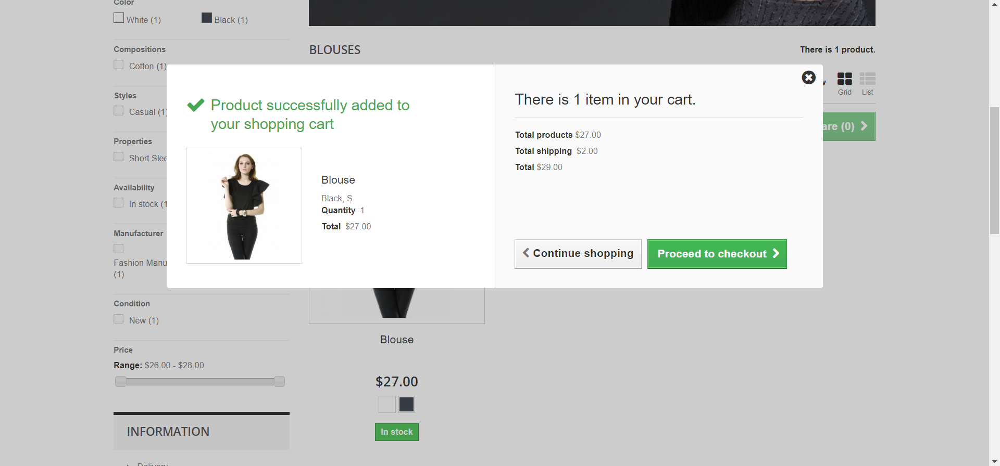
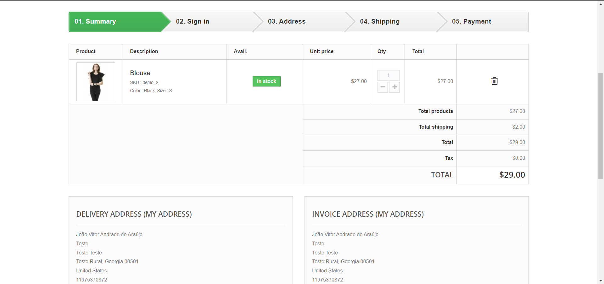
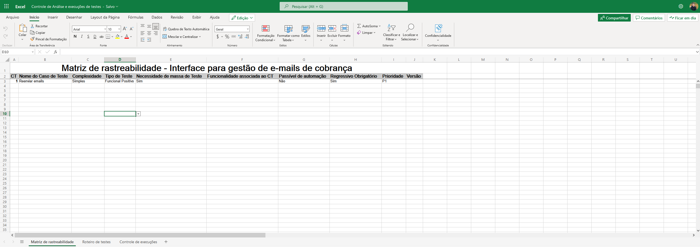
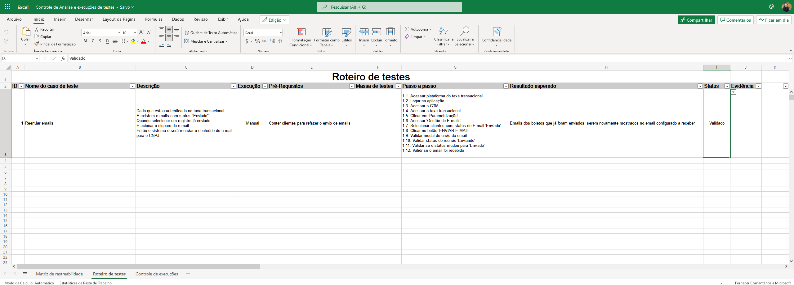
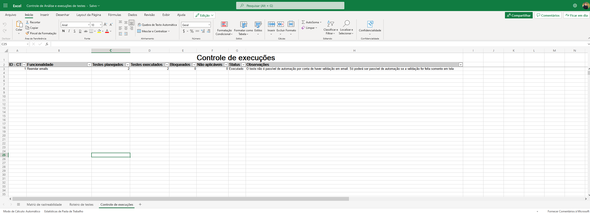

# Mapeamento de cenários de testes - Raro Labs :smiley:

### Oberservações gerais:

Utilizei um site de testes em automação e gostaria de realizar os cenários automatizados sobre os quais eu descrevi. No entanto, o site está completamente sem performance, o que prejudica uma automação com sucesso, realizei apenas os possíveis cenários de login que ainda assim estão sendo realizados com bastante lentidão, devido a plataforma.

Mas é somente para análise de escrita de código e organização.

### Para rodar os testes automatizados :rocket::
- Pré-requisitos
  - Ter node 16.15.1 instalado (ou superior)
  - Ter NPM (normalmente vem instalado junto ao node) 8.11.0 instalado (ou superior)
  - No ambiente windows, é necessário colocar o node nas variávies de ambiente (na instalação, há uma flag de atalho para isso)

- Fazer o clone do projeto
- executar os comandos:
  - npm install
  - npm test:open (se quiser acompanhar via interface do cypress)
  - npm test (caso queira acompanhar os testes via linha de comando, como é executado em ambiente contínuo)
- Selecionar o teste de login e acompanhar na interface do cypress

Caso o comando não rode, execute na mão os comandos descritos nas chaves dos scripts

#

#### 1-) Como é feito seu levantamento de testes :dart:

Partindo do pressuposto que eu não conheço o sistema, antes de qualquer coisa, sempre busco fazer os testes exploratórios para conhecimento do produto. Como entradas, saídas e comportamentos. 

Busco entender o projeto por inteiro, para entender os impactos e relações do produto entre si.

- Exemplo:
    Em um sistema qualquer eu iniciaria fazendo os testes de ponta a ponta, para iniciar os aprendizados do e conhecer as regras de negócio.

    - Gerar uma taxa
    - Gerar um cadastro
    - Realizar uma consulta

    Ou qualquer outro exemplo, sempre iniciaria os testes de um possível login até o final (teste funcional positivo).

    Partindo de um site de compras, iniciaria os testes desde o login até seu fluxo completo.

    - 1.1 Login
    
    
    - 1.2. Colocar credenciais
    
    
    - 1.3. Validar login
    

    - 1.4. Adicionar produto ao carrinho
    

    - 1.5. Validar modal de inserção de produto e seguir para compra
    

    - 1.6. Validar dados no carrinho e informações cadastradas
    

    E assim por diante até seguir o caminho de sucesso de compra realizada com sucesso

#### 2-) Como são mapeados os cenários e como você se prepara para testar? :dart:

Normalmente parto de uma solução criada e mapeada pelo P.O., caso isso não exista, dou prioridade para os cenáriios de testes regressivos em sua prioridade. Costumo usar uma planilha do excel para executar esses tipos de testes.

Exemplo:
### Matriz de Rastreabilidade:
- A prioridade pode ser adaptada para os tipos de sistemas e projetos, de maneira geral, eu costumo usar de P1 a P4

- Onde P1 são os testes com maior prioridade de execução e P4 de menor prioridade

### Roteiro de testes
- No roteiro, eu mapeio cada detalhe dos testes a serem executados, desde um BDD até uma especificação detalhada do processo

### Controle de execuções
- Descrição de planejamentos de cenários e observações gerais sobre cada cenário teste
